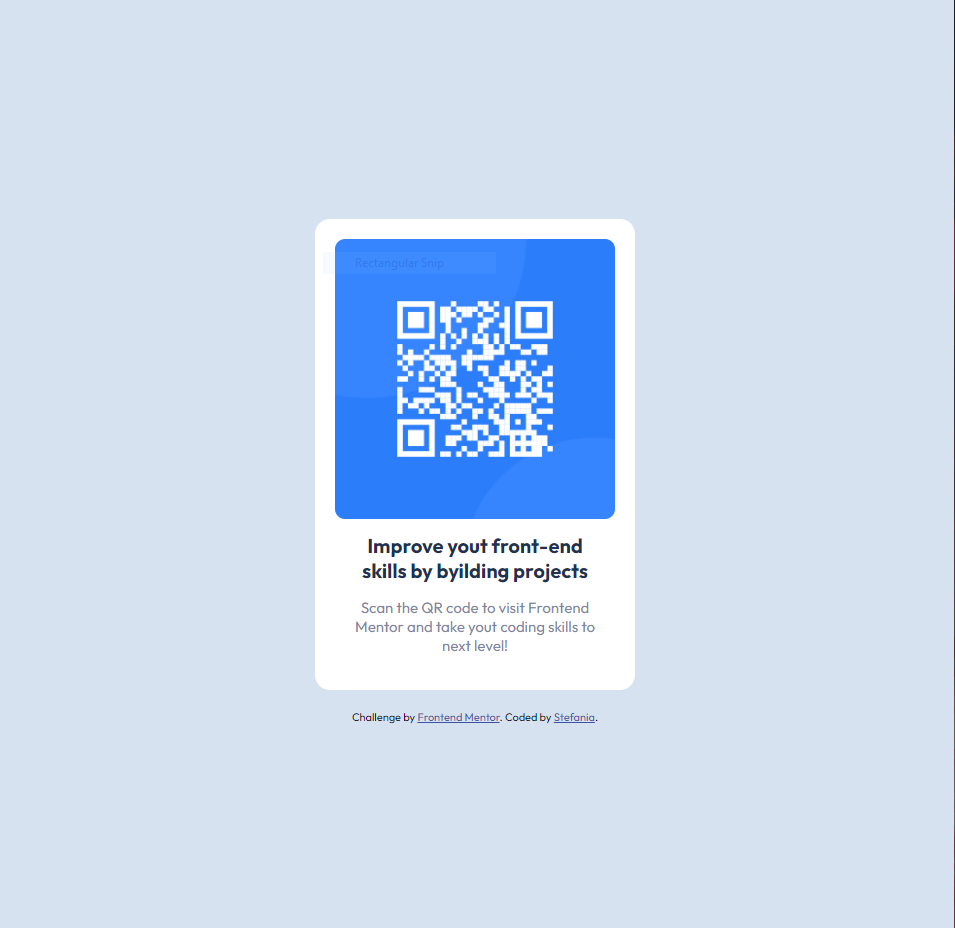

# Frontend Mentor - QR code component solution

## Overview

### Screenshot

### Links

- Live Site URL: [Add live site URL here]([https://your-live-site-url.com](https://goat3ggs.github.io/qr-code-component/))

### Built with

- Semantic HTML5 markup
- CSS custom properties
- Flexbox

### Continued development

Some things I want to continue focusing on in the future are writing clean code, on bulding the html in a more correct way to easily target the elements I need. I also want to practice more using the CSS Grid and Flexbox.

### Useful resources

- [Fonts](https://fonts.google.com/) - It is a great resoure for finding the most suitable fonts.
